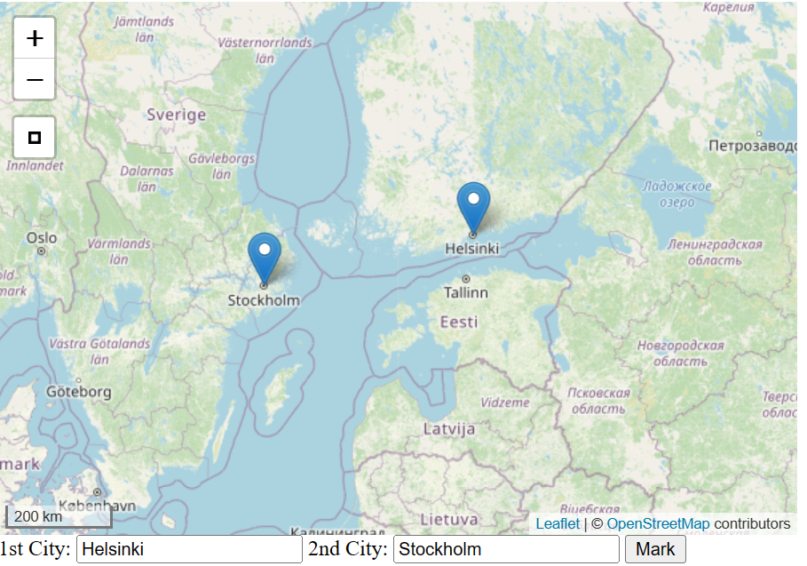

# Matkalla Italiaan

## Description

A city finder on world map built on Django and Leaflet.



## Installation

Step 1:

Clone the project. Python and pip are required. Also virtual environment is recommended. You can create and activate one using commands

```
python3 -m venv .venv
source .venv/bin/activate
```

Step 2: Install necessary python packages

```
pip install -r requirements.txt
```

Step 3: Run inside folder __djangoleaflet__

```
python manage.py runserver
```